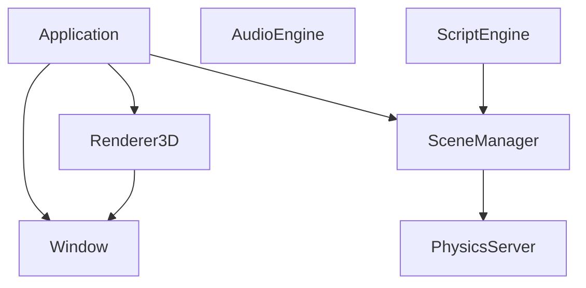

# Engine Architecture Overview

## Subsystems

## Data Flow

- **Update loop:** Application runs fixed timestep for physics, variable timestep for rendering.
- **Scene graph:** Entities form a hierarchy; TransformComponent provides world transforms.
- **Rendering:** Renderer3D collects mesh draws, sorts by shader/material, submits to GPU. Frustum culling skips off-screen objects.
- **Physics:** PhysicsWorld steps rigid bodies and constraints; CollisionDetector uses SpatialHash for broad phase.
- **Scripting:** Lua scripts attach to entities via ScriptComponent; hot-reload supported.

## ECS Design

- **Entity:** UUID handle; no data stored on the handle.
- **Component:** Stored in Scene; components reference owner by UUID + Scene pointer.
- **Scene:** Owns entity registry (UUID → data), component storage, and name index.
- **Serialization:** JSON `.scene` files with component data; versioned for migrations.

## Rendering Pipeline

1. **BeginScene(camera):** Upload camera UBO, extract frustum for culling.
2. **Submit(mesh, material, transform):** Frustum test; if visible, add to batch.
3. **EndScene:** Sort by shader/material, upload lighting UBO, draw batches.
4. **Post-process:** Deferred pipeline (GBuffer → SSAO → lighting → FXAA/Bloom).

## Physics Pipeline

1. **Broad phase:** SpatialHash for potential collider pairs.
2. **Narrow phase:** CollisionDetector (sphere-sphere, box-box, etc.).
3. **Solver:** Sequential impulses for constraints; Verlet/Euler integration for rigid bodies.
