# LAG Engine

**LAG Engine** is a modular, cross-platform 3D game engine written in C++17. It provides a complete runtime with physics simulation, deferred rendering, Lua scripting, spatial audio, and a full-featured editor built on ImGui.

Designed for both educational use and as a foundation for real-time applications, the engine ships with ten example projects covering rendering, rigid/soft body physics, fluid dynamics, character control, and robotic simulation. It also includes a standalone RL benchmark suite for frame scheduling optimization and eleven foundational demos from early engine development.

<p align="center">
  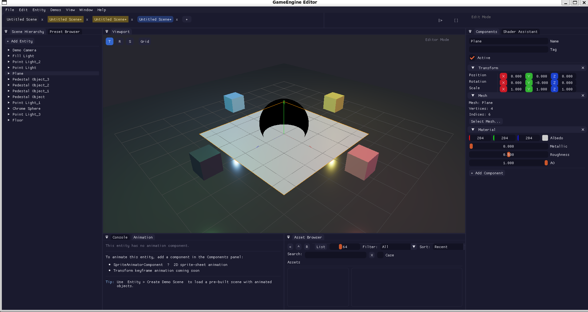
</p>
<p align="center"><em>LAG Engine Editor -- scene hierarchy, 3D viewport with PBR materials, component inspector, and asset browser</em></p>

---

## Table of Contents

- [Showcase](#showcase)
- [Features](#features)
- [System Architecture](#system-architecture)
- [Getting Started](#getting-started)
  - [Prerequisites](#prerequisites)
  - [Quick Start with setup.sh](#quick-start-with-setupsh)
  - [Building from Source](#building-from-source)
- [Running](#running)
- [Project Structure](#project-structure)
- [CMake Options](#cmake-options)
- [Editor](#editor)
- [Physics Simulations](#physics-simulations)
- [Scripting](#scripting)
- [RL Backend](#rl-backend)
- [Live Working Demos](#live-working-demos)
- [Documentation](#documentation)
- [Troubleshooting](#troubleshooting)
- [Contributing](#contributing)
- [License](#license)

---

## Showcase

<table>
  <tr>
    <td align="center" width="50%">
      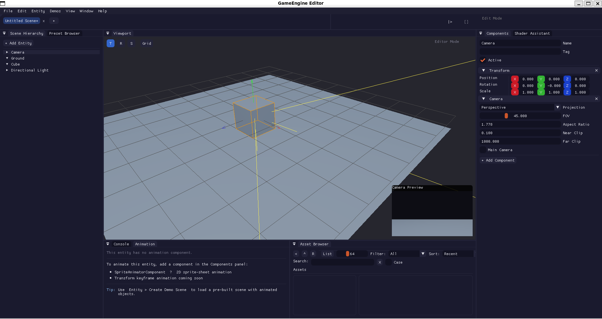<br>
      <em>Editor -- Transform gizmos, scene hierarchy, camera preview</em>
    </td>
    <td align="center" width="50%">
      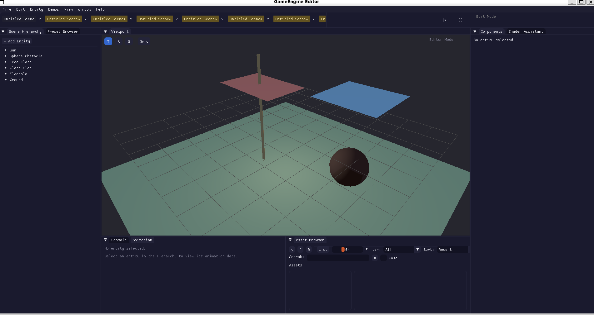<br>
      <em>Editor -- Cloth physics scene with multiple entities</em>
    </td>
  </tr>
  <tr>
    <td align="center">
      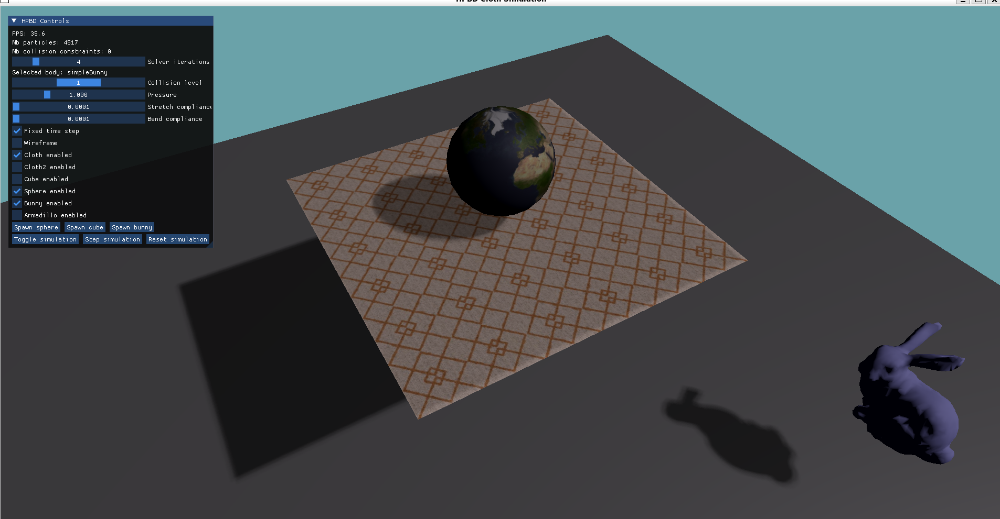<br>
      <em>XPBD soft body -- deformable globe and Stanford bunny</em>
    </td>
    <td align="center">
      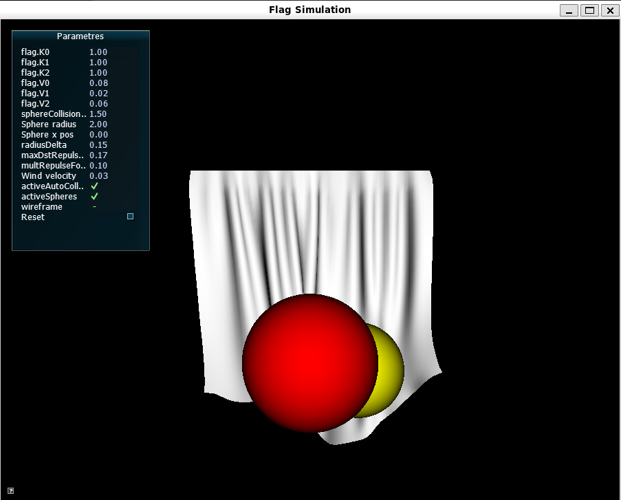<br>
      <em>Spring-mass cloth with sphere collision and wind</em>
    </td>
  </tr>
  <tr>
    <td align="center">
      <br>
      <em>SPH fluid dynamics -- honey simulation with funnel scene</em>
    </td>
    <td align="center">
      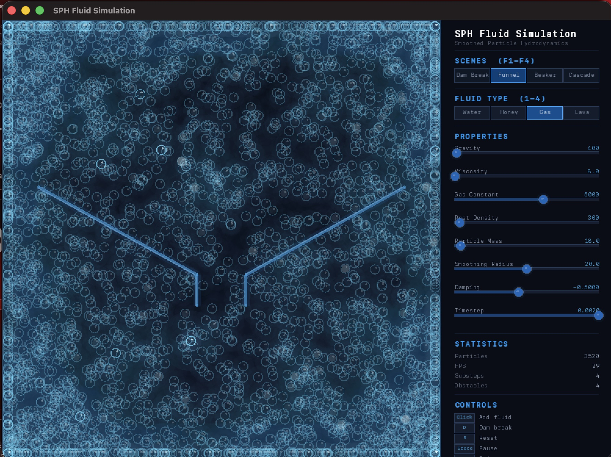<br>
      <em>SPH fluid dynamics -- gas simulation with 3500+ particles</em>
    </td>
  </tr>
  <tr>
    <td align="center">
      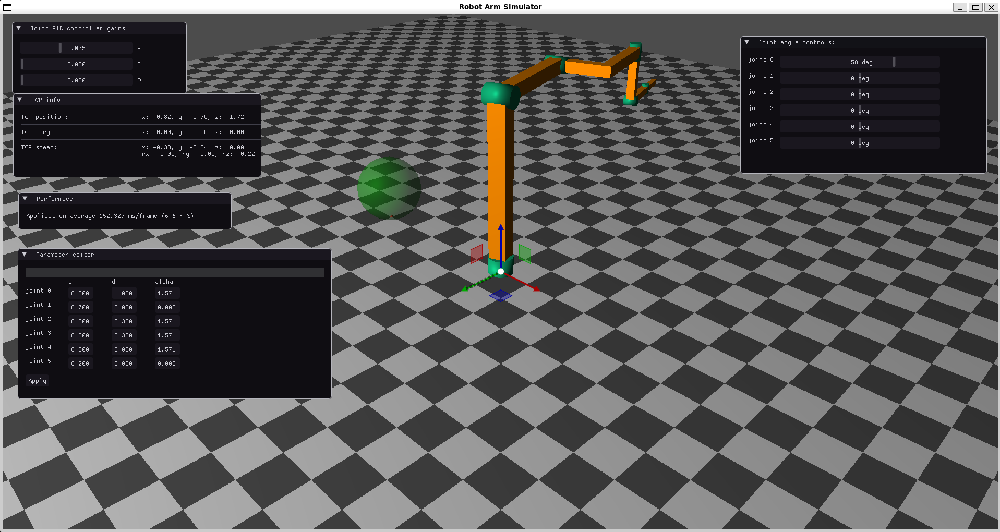<br>
      <em>Robot arm -- forward/inverse kinematics with DH parameters</em>
    </td>
    <td align="center">
      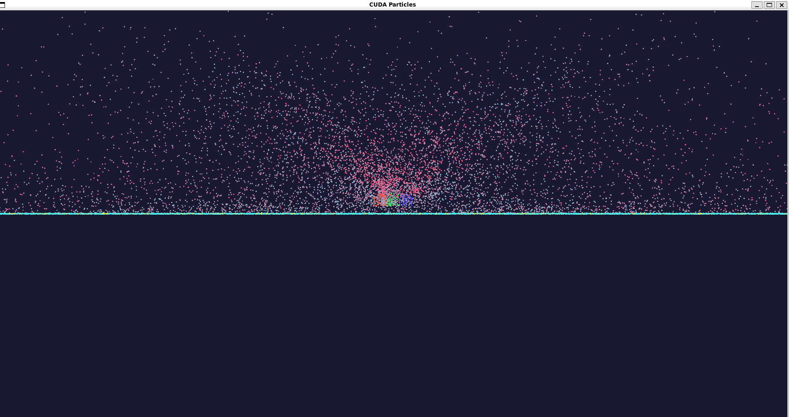<br>
      <em>CUDA-accelerated GPU particle system</em>
    </td>
  </tr>
  <tr>
    <td align="center">
      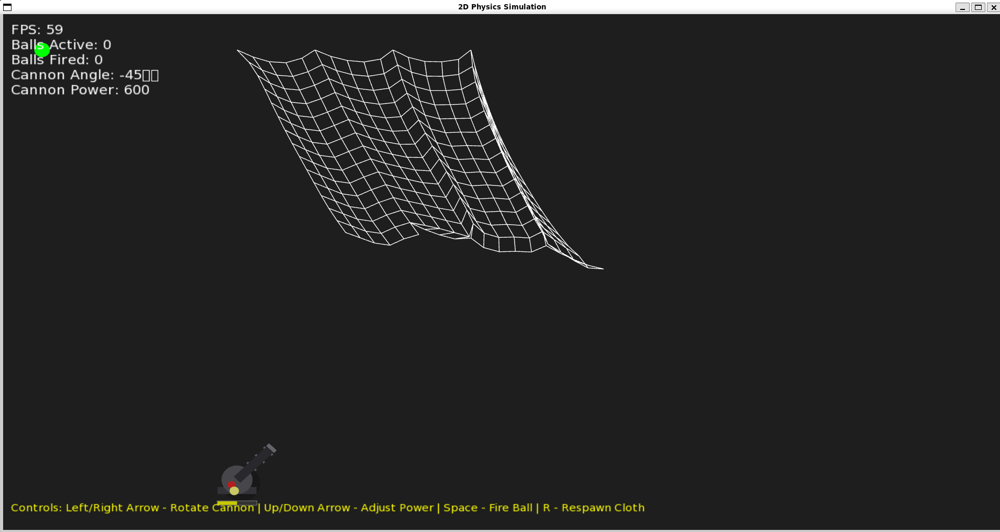<br>
      <em>Verlet integration -- 2D cloth with cannon physics</em>
    </td>
    <td align="center">
      <br>
      <em>RL Backend -- 8000 body N-body simulation with frame profiler</em>
    </td>
  </tr>
  <tr>
    <td align="center" colspan="2">
      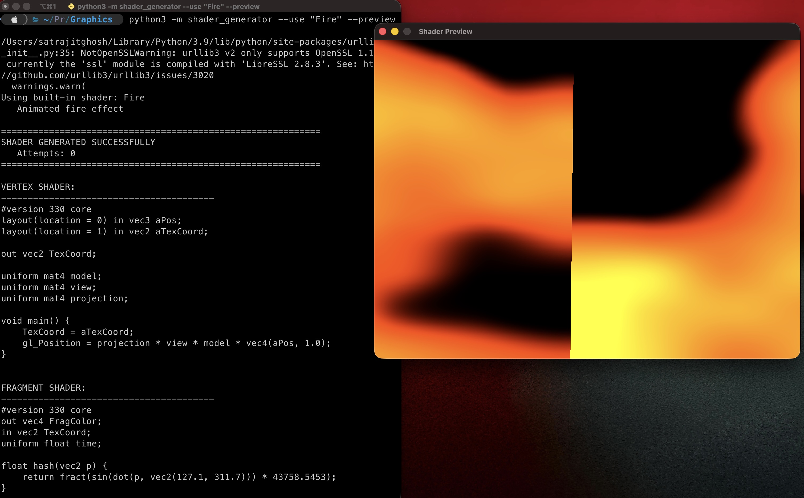<br>
      <em>AI-powered shader generator -- procedural fire effect via Ollama</em>
    </td>
  </tr>
</table>

---

## Features

### Graphics

- OpenGL 4.x deferred rendering pipeline with GBuffer
- Physically-based rendering (PBR) material system
- Shadow mapping, screen-space ambient occlusion (SSAO), and image-based lighting (IBL)
- Frustum culling and shader/material draw-call batching
- 2D batch renderer and GPU-instanced particle system
- Shader hot-reload from disk

### Physics

- Rigid body dynamics with sequential-impulse constraint solver
- Collision detection with spatial hash broadphase (sphere, box, capsule, plane)
- Soft body simulation via XPBD solver with tearable cloth
- SPH fluid dynamics with spatial hash acceleration
- Constraint system: fixed, hinge, and slider joints
- Character controller with slope handling and jump mechanics
- Multiple integrators: Euler, Verlet, semi-implicit

### Audio

- 3D spatial audio via OpenAL Soft
- Distance attenuation and Doppler effect
- Streaming playback with looping support

### Scene and Entity System

- Entity-component architecture with UUID-based entity handles
- Parent-child transform hierarchy with cached world matrices
- JSON scene serialization and deserialization
- Scene merging and prefab support

### Scripting

- Lua integration with C++ bindings for entities, components, math, input, and audio
- Script hot-reload
- Interactive scripting console in the editor
- AI-powered shader assistant (Ollama integration)

### Editor

- Full docking-based editor (ImGui) with play/pause/step controls
- Scene hierarchy, viewport, component inspector, asset browser, console, and profiler panels
- Undo/redo command system
- Gizmo-based entity manipulation (translate, rotate, scale)
- Shader hot-reload via file watcher
- Theme editor and auto-save
- Multi-tab scene editing

### Platform

- Cross-platform: Windows, macOS, Linux
- GLFW window and input abstraction
- File dialogs and file watcher for asset hot-reload
- Multithreaded job system with work-stealing scheduler

---

## System Architecture

<p align="center">
  
</p>
<p align="center"><em>Full engine architecture -- build system, rendering pipeline, physics subsystems, ECS, scripting, and editor</em></p>

```text
Application (main loop, fixed timestep)
  |
  +-- Window (GLFW)
  +-- SceneManager
  |     +-- Scene -> Entity/Component storage
  |     +-- PhysicsServer -> PhysicsWorld, CollisionDetector, Constraints
  +-- Renderer3D -> GBuffer, ShadowMap, SSAO, IBL, DeferredRenderer
  +-- AudioEngine (OpenAL)
  +-- ScriptEngine (Lua)
  +-- JobSystem (work-stealing thread pool)
```

The update loop uses a fixed timestep for physics (default 60 Hz) with variable-rate rendering. The renderer collects draw commands via `Submit()`, sorts by shader and material, and flushes in `EndScene()`. Physics runs broadphase spatial hashing, narrowphase collision detection, and constraint solving each fixed step.

For a detailed breakdown, see [Documentation/Architecture/EngineOverview.md](Documentation/Architecture/EngineOverview.md).

---

## Getting Started

### Prerequisites

**Windows**

- Visual Studio 2019 or later with the **C++ Desktop Development** workload
- CMake 3.20+
- Git (with Git Bash for running setup.sh)

**macOS**

```bash
brew install cmake llvm openal-soft pkg-config
```

**Linux (Ubuntu/Debian)**

```bash
sudo apt update
sudo apt install build-essential cmake git \
    libgl1-mesa-dev libx11-dev libxrandr-dev libxinerama-dev \
    libxcursor-dev libxi-dev libopenal-dev
```

**Linux (Fedora)**

```bash
sudo dnf install gcc-c++ cmake git mesa-libGL-devel \
    libX11-devel libXrandr-devel libXinerama-devel \
    libXcursor-devel libXi-devel openal-soft-devel
```

### Quick Start with setup.sh

The project includes `setup.sh`, an interactive build script that handles everything -- dependency installation, building the engine, RL Backend, and all 11 live demos. It detects your OS automatically and provides a terminal menu for all operations.

```bash
git clone https://github.com/satrajitghosh183/LAGEngine.git
cd LAGEngine
```

**Linux / macOS / WSL / Git Bash:**

```bash
bash setup.sh
```

**Windows (CMD or PowerShell):**

```cmd
setup.bat
```

The `setup.bat` wrapper locates Git Bash on your system and launches `setup.sh` through it. You do not need to install Git Bash separately if you have Git for Windows installed.

**What setup.sh provides:**

| Menu Option | Description |
| --- | --- |
| 1 | Install system dependencies (apt/dnf/pacman/brew) |
| 2 | Pre-flight check (verify cmake, compiler, python, CUDA) |
| 3 | Build LAGEngine (engine + editor + all 10 examples) |
| 4 | Build RL_Backend (C++20 rendering + RL benchmark suite) |
| 5 | Setup Python RL environment (venv + pip) |
| 6 | Build all 11 Live-working-demos |
| 7 | Build a specific Live demo |
| 8 | Build everything at once |
| e | Run the GameEngine Editor |
| r | RL_Backend launcher (6 demos + training + TensorBoard) |
| d | Run a Live-working-demo |
| t | Run all tests (GTest + Catch2 + Python smoke) |
| s | Show project structure tree |
| p | Show full dependency matrix |

**CLI flags for non-interactive / CI use:**

```bash
bash setup.sh --install         # Install system dependencies only
bash setup.sh --preflight       # Check required tools
bash setup.sh --build-engine    # Build the main engine
bash setup.sh --build-rl        # Build RL_Backend
bash setup.sh --build-demos     # Build all Live-working-demos
bash setup.sh --build-all       # Build everything
bash setup.sh --setup-python    # Setup RL Python venv
bash setup.sh --test            # Run all tests
bash setup.sh --help            # Show all options
```

### Building from Source

If you prefer to build manually without setup.sh:

```bash
mkdir build && cd build
cmake ..
cmake --build . -j$(nproc)
```

On Windows with Visual Studio:

```cmd
mkdir build
cd build
cmake ..
cmake --build . --config Release
```

Alternatively, open the project folder directly in Visual Studio or CLion and use the built-in CMake integration.

---

## Running

All executables are output to `build/bin/`.

| Executable | Description |
| --- | --- |
| `GameEngineEditor` | Full editor application |
| `HelloTriangle` | Minimal rendering example |
| `PhysicsDemo` | Rigid body physics simulation |
| `ClothSimulation` | Tearable cloth with wind interaction |
| `CharacterController` | Player movement and jumping |
| `FluidSimulation` | SPH fluid dynamics |
| `RobotArm` | Articulated robotic arm with IK |
| `Physics2DDemo` | 2D Verlet cloth and cannon physics |
| `HXPBDPhysics` | XPBD soft body simulation |
| `FlagSimulation` | Spring-mass flag physics |
| `LegacyParticles` | Classic particle system |

```bash
./bin/GameEngineEditor
./bin/PhysicsDemo
```

---

## Project Structure

```text
LAGEngine/
    Assets/                  Game assets (shaders, textures, scenes)
    Content/                 Presets and project templates
    Documentation/
        API/                 API reference (Core, Scene)
        Architecture/        Engine architecture overview
        Manual/              Getting started, editor guide, scripting API
        Tutorials/           Step-by-step tutorials (5 topics)
    Editor/
        Core/                Editor state, command system, hotkeys
        Gizmos/              Viewport gizmos
        Panels/              All editor panels (13+)
    Engine/
        Animation/           Skeletal animation and state machine
        Assets/              Asset management and caching
        Audio/               OpenAL audio engine
        Core/                Application, logger, job system, frame scheduler, UUID
        Graphics/            Renderer, shaders, materials, meshes, deferred pipeline
        ParticleSystem/      GPU particle compute and instanced rendering
        Physics/
            Character/       Character controller
            Collision/       Collision detection, spatial hash
            Constraints/     Fixed, hinge, slider joints
            Fluids/          SPH solver, spatial hash grid, kernels
            Integrators/     Euler, Verlet, semi-implicit
            SoftBody/        XPBD solver, tearable cloth, octree accelerator
        Platform/            Window, input, file dialogs, file watcher
        Robotics/            Robotic arm simulation, IK solver
        Scene/               Entity, scene, components, serialization, prefabs
        Scripting/           Lua engine, script bindings
        UI/                  UI renderer
        Utilities/           Debug draw, math utilities
    Examples/                10 example applications
        01_HelloTriangle/  ...  10_LegacyParticles/
    External/                Third-party libraries (bundled)
    Tests/                   Unit test suite (GTest, ~185 test cases)
    Tools/                   Project creation utility (Python)
    RL_Backend/              Standalone C++20 rendering + RL benchmark suite
        engine/              JobSystem, RenderThread, IndirectDrawBuilder
        demos/               6 visual + headless demos
        rl/                  Python RL training (12 algorithms)
        bindings/            pybind11 environment bridge
    Live-working-demos/      11 foundational physics/rendering prototypes
        01-verlet-physics/  ...  11-spring-block-sim/
    Thesis_Documents/        Master thesis report, images, and references
```

---

## CMake Options

| Option | Default | Description |
| --- | --- | --- |
| `BUILD_EXAMPLES` | `ON` | Build the example applications |
| `BUILD_EDITOR` | `ON` | Build the editor |
| `BUILD_TESTS` | `ON` | Build the unit test suite |
| `BUILD_SHARED_LIBS` | `OFF` | Build as shared libraries instead of static |

```bash
cmake .. -DBUILD_TESTS=ON -DBUILD_EXAMPLES=OFF
```

---

## Editor

The editor provides a complete scene authoring environment with a docking-based ImGui interface.

<table>
  <tr>
    <td align="center" width="50%">
      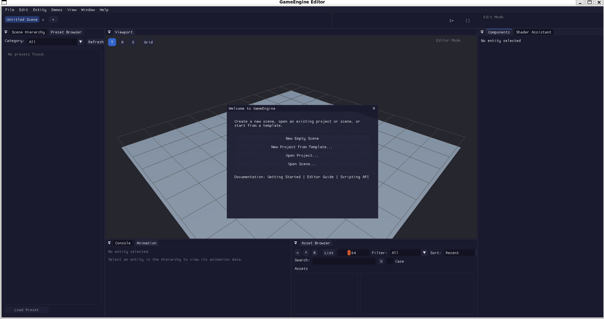<br>
      <em>Welcome dialog -- create scenes, open projects, browse templates</em>
    </td>
    <td align="center" width="50%">
      <br>
      <em>3D viewport with transform gizmos and camera preview</em>
    </td>
  </tr>
</table>

- **Scene Hierarchy** -- tree view of all entities with drag-and-drop reparenting
- **Viewport** -- 3D scene view with translation/rotation/scale gizmos
- **Components Inspector** -- edit transform, mesh, material, physics, audio, and script properties
- **Asset Browser** -- browse and import project assets
- **Console** -- filterable log output from the engine logger
- **Scripting Console** -- interactive Lua REPL with full engine API access
- **Profiler** -- per-frame timing breakdown
- **Shader Assistant** -- AI-powered GLSL generation via Ollama
- **Graphics Settings** -- toggle VSync, SSAO, shadow quality, and other render options
- **Theme Editor** -- customize the editor appearance
- **Animation Panel** -- view and edit sprite/skeletal animation data

Play mode snapshots the scene state, runs the simulation, and restores on stop. Undo/redo is supported for entity and component operations. Multiple scenes can be open simultaneously in tabs.

---

## Physics Simulations

The engine implements multiple physics subsystems, each demonstrated in dedicated examples and live demos.

<table>
  <tr>
    <td align="center" width="50%">
      <br>
      <em>XPBD -- deformable soft bodies with real-time interaction</em>
    </td>
    <td align="center" width="50%">
      <br>
      <em>Spring-mass cloth with sphere collision detection</em>
    </td>
  </tr>
  <tr>
    <td align="center">
      <br>
      <em>SPH fluid -- multiple fluid types (water, honey, gas, lava)</em>
    </td>
    <td align="center">
      <br>
      <em>Articulated robot arm with FK/IK and PID control</em>
    </td>
  </tr>
  <tr>
    <td align="center">
      <br>
      <em>Verlet integration -- 2D/3D cloth with cannon interaction</em>
    </td>
    <td align="center">
      <br>
      <em>CUDA-accelerated particle system with ground collision</em>
    </td>
  </tr>
</table>

**Supported physics models:**

| Model | Solver | Use Case |
| --- | --- | --- |
| Rigid Body | Sequential Impulse | Objects, stacking, collisions |
| Soft Body | XPBD | Deformable objects, tearable cloth |
| Cloth | Spring-Mass / Verlet | Flags, fabric, curtains |
| Fluids | SPH | Water, honey, gas, lava |
| Joints | Fixed / Hinge / Slider | Doors, chains, robot arms |
| Character | Kinematic Controller | Player movement, slopes, jumping |

---

## Scripting

Lua scripts attach to entities via `ScriptComponent`. The engine exposes bindings for:

- Entity creation, destruction, and queries
- Component access (Transform, RigidBody, Audio, etc.)
- Math types (Vec3, Quaternion, Mat4)
- Input polling (keyboard, mouse)
- Audio playback
- Logging

Scripts are hot-reloaded when the source file changes on disk.

See [Documentation/Manual/ScriptingAPI.md](Documentation/Manual/ScriptingAPI.md) for the full API reference.

---

## RL Backend

`RL_Backend/` is a standalone multithreaded rendering and reinforcement learning benchmark suite. It explores how RL agents can optimize real-time frame scheduling decisions in a rendering pipeline.

<table>
  <tr>
    <td align="center" width="50%">
      <br>
      <em>Parallel N-body physics with work-stealing job system</em>
    </td>
    <td align="center" width="50%">
      <br>
      <em>RL Backend architecture -- engine loop, pybind11 bridge, policy networks</em>
    </td>
  </tr>
</table>

**Key components:**

- **C++20 engine** with a Chase-Lev work-stealing job system, indirect draw rendering, and N-body physics
- **6 demo executables**: hello triangle, 10K-100K instanced cubes, single-threaded and parallel N-body, RL-driven physics, and a headless job system microbenchmark
- **Python RL training** with 12 algorithms (PPO, SAC, DQN, A2C, TD3, AWSS, and more)
- **pybind11 bindings** exposing a Gymnasium-compatible `FrameSchedulerEnv`

**CMake options for RL_Backend:**

| Option | Default | Description |
| --- | --- | --- |
| `RL_BACKEND_BUILD_CUDA` | `OFF` | Enable CUDA GPU physics |
| `RL_BACKEND_BUILD_RL` | `OFF` | Build Python bindings (requires pybind11) |
| `RL_BACKEND_BUILD_TESTS` | `OFF` | Build Catch2 test suite |

Build and run via `bash setup.sh` (option 4 from the menu), or manually:

```bash
cd RL_Backend
mkdir build && cd build
cmake .. -DCMAKE_BUILD_TYPE=Release -DRL_BACKEND_BUILD_RL=ON
cmake --build . -j$(nproc)

# Run a demo
./bin/demo_physics_parallel

# Train an RL agent
cd ../rl
python train.py --algo ppo --env FrameSchedulerEnv --steps 50000
```

See [RL_Backend/README.md](RL_Backend/README.md) for full details.

---

## Live Working Demos

`Live-working-demos/` contains 11 self-contained projects built during early engine development. Each explores a specific technique that was later integrated into the main engine.

| # | Demo | Description | Tech |
| --- | --- | --- | --- |
| 01 | [verlet-physics](Live-working-demos/01-verlet-physics/) | 2D/3D cloth simulation with Verlet integration | C++17, SFML, OpenGL, GLFW |
| 02 | [spring-cloth-simulation](Live-working-demos/02-spring-cloth-simulation/) | Spring-mass flag/cloth simulation | C++11, SDL, OpenGL, GLEW |
| 03 | [xpbd-soft-body](Live-working-demos/03-xpbd-soft-body/) | XPBD soft body physics with PBR materials | C++17, OpenGL, GLFW, Eigen |
| 04 | [particle-system](Live-working-demos/04-particle-system/) | 3D particle system with collision and gravity | C++, freeglut, OpenGL |
| 05 | [gpu-particles-cuda](Live-working-demos/05-gpu-particles-cuda/) | CUDA-accelerated GPU particle simulation with RL | C++17, CUDA, OpenGL |
| 06 | [deferred-rendering](Live-working-demos/06-deferred-rendering/) | Deferred rendering pipeline with DAG scheduling | C++17, CUDA, OpenGL, GLFW |
| 07 | [robot-arm-kinematics](Live-working-demos/07-robot-arm-kinematics/) | Robot arm FK/IK with DH parameters and PID control | C++17, OpenGL, Eigen, ImGuizmo |
| 08 | [imgui-editor](Live-working-demos/08-imgui-editor/) | ImGui-based scene editor prototype | C++17, OpenGL, GLFW, ImGui |
| 09 | [cmake-shader-tools](Live-working-demos/09-cmake-shader-tools/) | Python tools for CMake generation and AI shader authoring | Python 3.8+, Ollama |
| 10 | [neural-character-generation](Live-working-demos/10-neural-character-generation/) | Neural character generation pipeline (WIP) | Python, PyTorch |
| 11 | [spring-block-sim](Live-working-demos/11-spring-block-sim/) | PBR spring-block simulator with bloom and shadow mapping | C++17, OpenGL, GLFW, ImGui |

Each C++ demo has its own `CMakeLists.txt` and README (demos 09-10 are Python-only). Build any C++ demo individually:

```bash
cd Live-working-demos/<demo-folder>
mkdir build && cd build
cmake ..
cmake --build .
```

Or build all demos at once via `bash setup.sh` (option 6 from the menu).

**Dependency strategy per demo:**

- Demos 01-04, 07: system packages + vendored loaders (GLAD, stb, Eigen, ImGui)
- Demos 05-06: CUDA required + vendored OpenGL loaders
- Demo 08, 11: CMake FetchContent for GLFW/GLM/ImGui, vendored GLAD
- Demos 09-10: Python only (pip install)

---

## Documentation

| Document | Path |
| --- | --- |
| Getting Started | [Documentation/Manual/GettingStarted.md](Documentation/Manual/GettingStarted.md) |
| Editor Guide | [Documentation/Manual/EditorGuide.md](Documentation/Manual/EditorGuide.md) |
| Scripting API | [Documentation/Manual/ScriptingAPI.md](Documentation/Manual/ScriptingAPI.md) |
| Engine Architecture | [Documentation/Architecture/EngineOverview.md](Documentation/Architecture/EngineOverview.md) |
| Core API Reference | [Documentation/API/CoreAPI.md](Documentation/API/CoreAPI.md) |
| Scene API Reference | [Documentation/API/SceneAPI.md](Documentation/API/SceneAPI.md) |
| Tutorial: First Scene | [Documentation/Tutorials/01_FirstScene.md](Documentation/Tutorials/01_FirstScene.md) |
| Tutorial: Physics Playground | [Documentation/Tutorials/02_PhysicsPlayground.md](Documentation/Tutorials/02_PhysicsPlayground.md) |
| Tutorial: Scripting with Lua | [Documentation/Tutorials/03_ScriptingWithLua.md](Documentation/Tutorials/03_ScriptingWithLua.md) |
| Tutorial: Custom Shaders | [Documentation/Tutorials/04_CustomShaders.md](Documentation/Tutorials/04_CustomShaders.md) |
| Tutorial: Cloth Simulation | [Documentation/Tutorials/05_ClothSimulation.md](Documentation/Tutorials/05_ClothSimulation.md) |

---

## Troubleshooting

### setup.sh produces no output on Windows

Do not run `./setup.sh` directly in PowerShell -- it cannot execute bash scripts. Use one of:

- `setup.bat` (from CMD or PowerShell)
- `bash setup.sh` (from Git Bash, WSL, or MSYS2)

### macOS OpenGL Deprecation Warnings

macOS has deprecated OpenGL but it remains functional. Suppress warnings with:

```bash
cmake .. -DCMAKE_CXX_FLAGS="-Wno-deprecated-declarations"
```

### Linux Missing OpenGL Headers

```bash
sudo apt install libgl1-mesa-dev
```

### Windows CMake Cannot Find Compiler

Ensure the Visual Studio C++ Desktop Development workload is installed. You can also specify the generator explicitly:

```cmd
cmake -G "Visual Studio 17 2022" ..
```

### Black Viewport in the Editor

Verify that a camera entity exists in the scene with the Main Camera flag enabled, and that its transform is positioned to view scene content.

### Missing Shaders at Runtime

When running from a build directory, ensure `Assets/Shaders/` is accessible. The engine resolves shader paths relative to the executable and project root via `RuntimePaths`.

### CUDA Demos Won't Build

Demos 05 (GPU Particles) and 06 (Deferred Rendering) require the NVIDIA CUDA Toolkit. If `nvcc` is not in your PATH, these demos will be automatically skipped by setup.sh.

---

## Contributing

Contributions are welcome. LAG Engine is open source under the MIT License.

### How to Contribute

1. **Fork** the repository on GitHub.
2. **Clone** your fork:
   ```bash
   git clone https://github.com/<your-username>/LAGEngine.git
   cd LAGEngine
   ```
3. **Create a branch** for your change:
   ```bash
   git checkout -b feature/your-feature-name
   ```
4. **Build and test** to make sure everything works:
   ```bash
   bash setup.sh --build-all
   bash setup.sh --test
   ```
5. **Commit** your changes with a clear message, then **push** to your fork:
   ```bash
   git push origin feature/your-feature-name
   ```
6. **Open a Pull Request** against `main` on the upstream repository. Describe what you changed, why, and include screenshots for any visual changes.

### Areas Where Help Is Welcome

- Bug fixes and platform compatibility (macOS, Linux, Windows)
- New examples or live demos
- Physics improvements (collision, constraints, solvers)
- Rendering features (post-processing, materials, pipeline)
- Expanded test coverage (Audio, Input, Graphics subsystems)
- Documentation improvements and tutorials
- RL Backend enhancements (new algorithms, benchmarks)

### Code Style

- C++17, modern idioms (RAII, smart pointers)
- `PascalCase` for classes, `camelCase` for functions, `m_PascalCase` for members
- 4-space indentation, no tabs

### Reporting Issues

Use GitHub Issues for bugs and feature requests. For bugs, include your OS, compiler version, steps to reproduce, and any error output.

---

## License

MIT License. See [LICENSE](LICENSE) for details.
